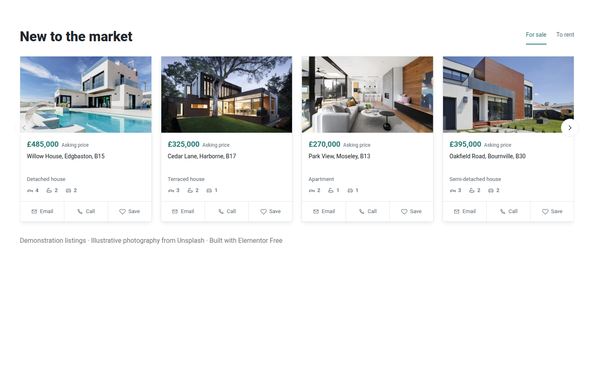
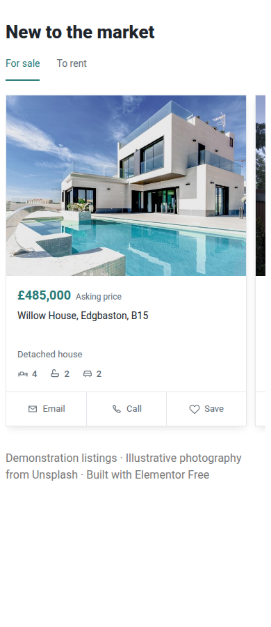

# Property Slider Free

A small, copyleft WordPress property-listing slider built for a simple use case: editable property data and a card carousel without Elementor Pro, ACF, JetEngine, or a paid slider plugin.

It registers a `Properties` custom post type, stores the listing fields as native WordPress post meta, and renders the cards either through a shortcode or an Elementor Free widget.



[Interactive HTML render](preview/index.html) · [Tablet screenshot](output/playwright/elementor-768.png) · [Mobile screenshot](output/playwright/elementor-390.png)

The screenshots show the native widget running in WordPress with **Elementor Free and Hello Elementor**, using illustrative Unsplash photographs. The HTML preview is exported from the actual PHP renderer and loads the same plugin CSS and JavaScript. GitHub displays HTML source: download the repository and open `preview/index.html`, or serve it with `python3 -m http.server 8080` and visit `/preview/`.



Demo addresses, prices and contacts are fictional. [Photograph sources](preview/images/README.md).

## Features

- `Properties` custom post type.
- Native WordPress fields for price, price note, address, property type, bedrooms, bathrooms, parking, sale/rent, email, and phone.
- Uses the normal Featured Image as the property image.
- Four equal cards at container widths of 1100px and up, with arrows and native horizontal scrolling.
- Approximately 2.35 cards at container widths of 640–1099px.
- On mobile, a card of 89vw, capped to leave a next-card hint inside narrower Elementor containers; no arrows below 768px viewport width.
- Mobile photographs use 4:3; wider containers retain the 1.72:1 desktop crop.
- Native touch swipe and mandatory scroll-snap, with 48px-high Email / Call / Save targets.
- Property type above a single compact bedroom / bathroom / parking row.
- `For sale` / `To rent` client-side filtering.
- Native Elementor widget when Elementor is active. Elementor Pro is **not** required.
- `[property_slider]` shortcode, so Elementor is optional.
- No ACF or other custom-field plugin required.
- No carousel dependency or CDN: CSS scroll-snap plus a small amount of vanilla JavaScript.
- Simple browser-local `Save` button using `localStorage`.

## Installation

### Option A: install the GitHub ZIP

1. On GitHub choose **Code → Download ZIP**.
2. In WordPress go to **Plugins → Add New Plugin → Upload Plugin**.
3. Select the downloaded ZIP and install it.
4. Activate **Property Slider Free**.
5. Go to **Properties → Add property**.
6. Enter the property data and set a **Featured Image**.
7. Publish several properties.
8. Add the slider to a page using one of the methods below.

### Option B: install the folder manually

1. Copy this repository into `wp-content/plugins/property-slider-free/`.
2. Activate **Property Slider Free** in WordPress.

## Elementor Free

If Elementor is active, search the Elementor widget panel for **Property Slider** and drag it onto the page.

The widget currently exposes:

- Heading
- Maximum number of properties
- Default tab
- Show/hide sale/rent tabs

You can also use Elementor's normal **Shortcode** widget with:

```text
[property_slider]
```

## Shortcode

Basic:

```text
[property_slider]
```

With options:

```text
[property_slider title="New to the market" limit="12" default="sale" show_filters="yes"]
```

`default` accepts `sale`, `rent`, or `all`.

## Editing a property

Each property is a normal WordPress post under **Properties**. The plugin adds a **Property data** box with the listing fields. You can change the data later and the slider will use the new values automatically.

The property photo comes from WordPress's **Featured Image** field.

## Styling

The front-end CSS lives in:

```text
assets/property-slider.css
```

Every component rule is scoped to `.psf.psf`; the repeated class deliberately raises specificity above common theme and Elementor tag rules, without relying on theme names or page IDs. Links, buttons, headings and images have explicit component defaults. The site font is inherited; `--psf-accent`, `--psf-text`, `--psf-muted` and `--psf-border` and `--psf-shadow` remain editable.

Normal styles deliberately remain **outside cascade layers**: normal unlayered theme styles would otherwise outrank them. A small `@layer psf-guard` uses `!important` only for box sizing, hidden state, image sizing/crop, minimum action height and hiding mobile arrows. Important declarations in a layer outrank unlayered important declarations. See [CSS layer precedence](https://developer.mozilla.org/en-US/docs/Web/CSS/Reference/At-rules/@layer).

This is practical isolation, not a guarantee against arbitrary CSS. Inline important styles, earlier important layers, deliberately stronger selectors and clipping/width constraints on ancestor Elementor containers still need site-specific attention. We do not reset the whole theme, change Elementor's global CSS, or use Shadow DOM.

A native `ResizeObserver` adapts the cards to the actual available widget width. This avoids an intrinsic-height conflict observed with inline-size containment inside Elementor flex widgets. A viewport-based CSS fallback remains before JavaScript initializes. Very narrow columns prioritize fitting the available space over the 89vw target.

## Known limitations / things to know

This is deliberately a small plugin rather than a full real-estate platform.

- **Arbitrary theme CSS cannot be universally neutralized.** Scoped resets and a limited guard layer protect common conflicts; the specific boundaries are documented above. Test custom themes on staging.
- **The preview is an actual renderer export, not a pixel-perfect guarantee across sites.** Font availability, Elementor container width, theme spacing, browser rendering, and image proportions all affect the result.
- The plugin does **not** provide a custom single-property or property-archive template. Clicking a card opens the normal WordPress single CPT URL and your active theme controls that page's layout.
- One Featured Image is supported per card. There is no gallery/lightbox implementation.
- `For sale` / `To rent` filtering happens in the browser and only filters the properties already loaded by the shortcode's `limit`; it is not an AJAX search or database filter UI.
- The price is stored as display text so any currency format can be used. That also means there is no numeric price sorting or range search.
- The `Save` heart is **local to that browser/device** through `localStorage`. It is not tied to a WordPress account and is not synchronized to the server.
- Contact email and phone links are rendered into the page source when supplied. Do not treat that as protection against scraping/spam.
- There is no MLS/IDX feed, property import, synchronization, map/geocoding, advanced search, pagination, favorites account, enquiry form, structured-data/schema package, or CRM integration.
- Accessibility has basic keyboard/focus/ARIA support, but this small project has not had a formal accessibility audit.
- There is no uninstall cleanup routine. Removing the plugin does not automatically delete the `psf_property` posts or their post meta, to avoid accidental data loss.
- It has not been tested against every WordPress, Elementor, browser, caching/minification, and theme combination. Test it on a staging site before relying on it in production.

If another theme/plugin conflicts with the component, inspect the computed styles first. In most cases the fix should be a small selector override in the theme or a fork of `assets/property-slider.css`.

## Reproduce the Elementor test installation

Requires Node.js/npm; no Docker or local database is needed. The Blueprint uses WordPress Playground with SQLite, installs Elementor Free and Hello Elementor, activates the plugin, and seeds six fictional listings with the committed photographs. It disables automatic updates/cron for repeatable testing and randomizes the demo administrator password. Do not run the seed against an existing site.

```bash
npx @wp-playground/cli server --wp=6.8.8 --php=8.3 --port=9400 \
  --mount="$PWD:/wordpress/wp-content/plugins/property-slider-free" \
  --blueprint=tests/blueprint.json
```

Open `http://127.0.0.1:9400/`. To repeat the browser checks and regenerate evidence:

```bash
npx @playwright/cli -s=property-slider open http://127.0.0.1:9400
npx @playwright/cli -s=property-slider run-code --filename=tests/browser-check.js
python3 tests/export-preview.py
```

[Validation details and limitations](tests/RESULTS.md). The browser check covers layout at 320, 390, 768, 1024 and 1440px, native scrolling, a Chromium synthesized touch swipe, snap alignment, vertical touch scrolling, filters, saved-state persistence, Elementor frontend rerender hooks, independent instances and deliberately conflicting CSS. Real phones and the Elementor editor UI require a separate manual check.

## Data model

The custom post type is:

```text
psf_property
```

The plugin stores these post-meta keys:

```text
_psf_price
_psf_price_note
_psf_address
_psf_property_type
_psf_beds
_psf_baths
_psf_parking
_psf_listing_type
_psf_email
_psf_phone
```

This keeps the data in ordinary WordPress storage rather than locking it into Elementor content.

## MU-plugin use

It is packaged as a normal plugin because that is simpler for most users. If you want it as an MU plugin, place the plugin folder under `wp-content/mu-plugins/` and add a loader PHP file directly inside `wp-content/mu-plugins/`:

```php
<?php
require WPMU_PLUGIN_DIR . '/property-slider-free/property-slider-free.php';
```

## License

`GPL-2.0-or-later`.

You may use, modify, redistribute, and sell the software under the terms of the GNU General Public License. Distributed derivative works remain subject to the GPL's copyleft requirements.

See [LICENSE](LICENSE).
